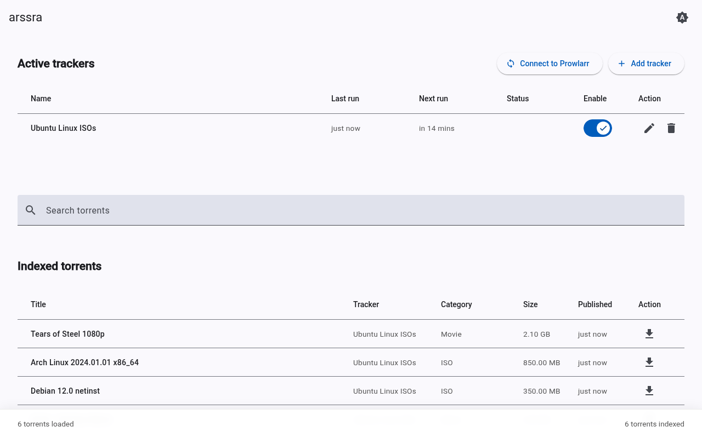
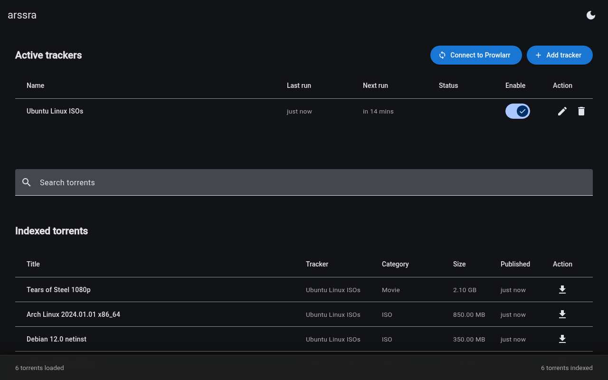

# arssra

**Automated RSS to Torznab**

arssra is a powerful, lightweight service that bridges RSS feeds to Torznab APIs. It seamlessly integrates with Prowlarr to automate torrent indexing, fetching, and syncing, all wrapped in a responsive Material UI dashboard.

---

## Table of Contents

- [Why it exists](#why-it-exists)
- [Screenshots](#screenshots)
- [Features](#features)
- [Supported trackers](#supported-trackers)
- [Prowlarr integration](#prowlarr-integration)
- [Installation](#installation)
- [Security considerations](#security-considerations)
- [Local development](#local-development)
- [License](#license)

## Why it exists

Some trackers are anti-automation and only provide RSS feeds. While RSS is useful for discovering new releases, the categories do not always align correctly with the *arr stack (Radarr, Sonarr, etc.). Furthermore, RSS feeds are inherently ephemeral; older releases quickly fall off the feed and can no longer be automated. 

arssra solves this by acting as a bridge. It continuously caches your RSS feeds into a persistent, searchable database and standardises the metadata. This historical backlog is then served via a fully compliant Torznab API, making it vastly more useful for automating older releases going forwards.

## Screenshots

<p align="center">
  
  
</p>

## Features

- **Automated RSS syncing:** Periodically pulls RSS feeds and indexes them locally.
- **Torznab API support:** Exposes indexed torrents via a standard Torznab endpoint, making it instantly compatible with the *arr stack (Sonarr, Radarr, Prowlarr).
- **Prowlarr integration:** Effortlessly sync and manage your indexers via a dedicated connection to your Prowlarr instance.
- **Material 3 UI:** A robust frontend built with Angular and Angular Material, featuring built-in light and dark themes that natively follow your system preferences.
- **Lightweight backend:** Powered by Node.js, Express, and Prisma with an embedded SQLite database.

## Supported trackers

arssra currently provides specialized RSS-to-Torznab indexing for the following trackers:

- **TV Chaos UK** (Broadcasting the best of British)

*More trackers can be supported by adding their definitions to the codebase.*

## Prowlarr integration

arssra features a fully automated integration with Prowlarr. Instead of manually configuring Torznab indexers, you can push the arssra configuration directly from the dashboard.

1. Open the arssra web dashboard.
2. Click the **Connect to Prowlarr** button at the top of the page.
3. Enter your Prowlarr URL (e.g., `http://192.168.1.100:9696`) and your Prowlarr API Key.
4. Enter your arssra URL so Prowlarr knows where to connect back (e.g., `http://192.168.1.100:3232`). *Note: If both arssra and Prowlarr are running on the same custom Docker network, you can use the container hostname instead (e.g., `http://arssra:3232`). This will not work on the default bridge network.*
5. Click **Auto-Sync**. 

arssra will automatically create or update a dedicated "arssra" Torznab indexer inside your Prowlarr instance. Prowlarr will then seamlessly pass this indexer down to Sonarr and Radarr.

### Manual Torznab configuration

Although arssra is designed with Prowlarr in mind, Prowlarr is completely optional. Because arssra acts as a standard Torznab indexer, it is fully compatible directly with Sonarr, Radarr, Lidarr, and any other application that supports Torznab.

If you prefer to configure your *arr applications manually, use the following Torznab details:

- **URL:** `http://<your-arssra-ip>:3232`
- **API Key:** Leave blank (or enter any string if required by the client)

## Installation

### Unraid

For Unraid users, an installation template is available in the following repository:
[https://github.com/dadarrs/unraid-templates](https://github.com/dadarrs/unraid-templates).

### Docker Compose

The easiest and recommended way to install arssra on other systems is via Docker Compose.

1. Create a `docker-compose.yml` file:

```yaml
services:
  arssra:
    image: ghcr.io/dadarrs/arssra:latest
    container_name: arssra
    ports:
      - "3232:3232"
    environment:
      - PUID=1000
      - PGID=1000
      - TZ=Etc/UTC
    volumes:
      - ./config:/app/config
    restart: unless-stopped
```

2. Start the container:

```bash
docker compose up -d
```

3. Access the web dashboard at `http://localhost:3232`.

> **Important:** Always ensure you mount the `/config` volume as shown above. This directory contains your persistent SQLite database and tracker configurations. If this is not mounted, your data will be permanently wiped out when the container is recreated or updated.

### Environment variables

| Variable | Description | Default |
| -------- | ----------- | ------- |
| `PUID` | User ID to run the app as (for file permissions) | `1000` |
| `PGID` | Group ID to run the app as | `1000` |
| `TZ` | Timezone | `Etc/UTC` |
| `PORT` | The internal port the webserver listens on | `3232` |

## Security considerations

> [!WARNING]  
> **Do not expose arssra publicly to the internet.**  
> This application is designed as an internal proxy for your home media server network. It does not have built-in authentication or rate limiting. Exposing it publicly could allow unauthorised access to your indexers or lead to abuse. If you must access it remotely, use a secure VPN (like Tailscale or WireGuard) or place it behind a secure reverse proxy with strict authentication and rate-limiting rules.

## Local development

If you want to contribute or run the app locally from source, you can set up the backend and frontend separately.

### Prerequisites
- Node.js (v24+)
- npm

### Backend setup

1. Navigate to the root directory and install dependencies:
   ```bash
   npm install
   ```
2. Initialize the Prisma SQLite database:
   ```bash
   npm run pretest
   ```
3. Start the backend development server:
   ```bash
   npm run dev
   ```

### Frontend setup

1. Navigate to the frontend directory:
   ```bash
   cd frontend
   npm install
   ```
2. Start the Angular development server:
   ```bash
   npm start
   ```

The frontend will proxy API requests to the backend automatically.

## License

This project is licensed under the MIT License. See the `LICENSE` file for details.